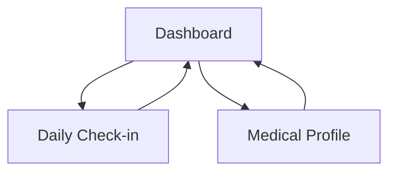

## 1. Product Overview
A local-first health monitoring web app that collects your medical history and daily wellness check-ins, then generates simple, actionable recommendations.
It stores data on-device (SQLite/JSON) and runs a lightweight scikit-learn model to surface insights without needing a cloud account.

## 2. Core Features

### 2.1 Feature Module
Our local health monitoring app consists of the following main pages:
1. **Dashboard**: today’s summary, recommendations, trends snapshot, recent check-ins.
2. **Medical Profile**: medical history intake, baseline metrics, medications/allergies, export/import.
3. **Daily Check-in**: daily wellness form, quick notes, submit and view submission result.

### 2.2 Page Details
| Page Name | Module Name | Feature description |
|---|---|---|
| Dashboard | Today Overview | Show latest vitals/wellness inputs (e.g., sleep, stress, symptoms) and last submission timestamp. |
| Dashboard | Recommendations | Display top recommendations generated from the model with short rationale and confidence/priority labels. |
| Dashboard | Trends Snapshot | Visualize 7/30-day trends for key signals (e.g., sleep, mood, pain, activity) in simple charts/tables. |
| Dashboard | History Feed | List recent check-ins; allow opening a check-in details view (read-only) in-page. |
| Medical Profile | Medical History Intake | Collect conditions, surgeries, family history, allergies, medications, and free-text notes; validate required fields. |
| Medical Profile | Baselines | Capture baseline metrics (age, height, weight, resting HR, typical sleep) to contextualize recommendations. |
| Medical Profile | Data Management | Export your data to a JSON file and import from a JSON file (for backup/migration). |
| Daily Check-in | Daily Wellness Form | Capture daily inputs (sleep hours/quality, mood, stress, activity, pain, symptoms checklist, notes) with basic validation. |
| Daily Check-in | Submission & Scoring | Save the entry locally; run the lightweight model to compute risk/insight scores and generate recommendation set. |
| Daily Check-in | Confirmation Summary | Show computed scores and recommended next steps immediately after submit. |

## 3. Core Process
**Primary flow (single local user):**
1. You open the app on your device and land on the Dashboard.
2. If it’s your first time, you fill out Medical Profile (history + baselines) and save.
3. Each day, you complete a Daily Check-in and submit.
4. The app stores your entry locally, runs the lightweight model, and immediately shows a concise recommendation summary.
5. You return to the Dashboard to review today’s recommendations and simple trends over time.
6. Optionally, you export your data to a JSON backup file.

