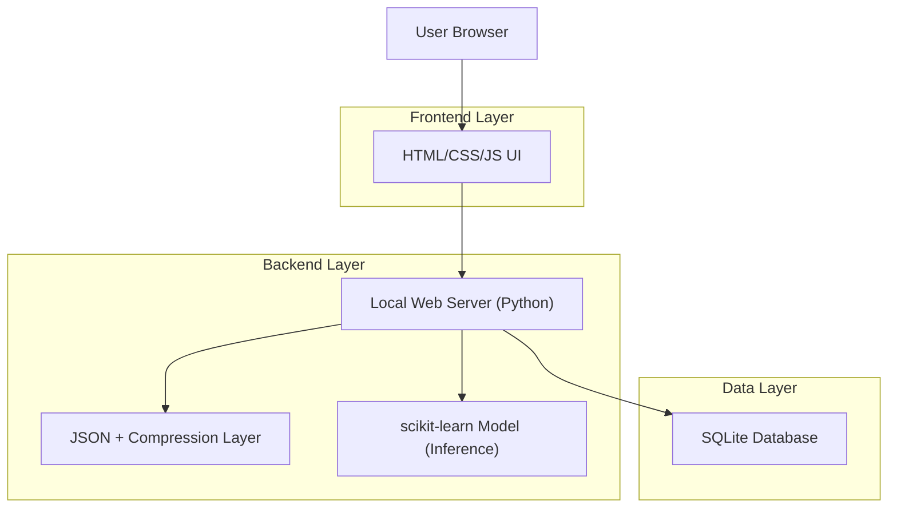
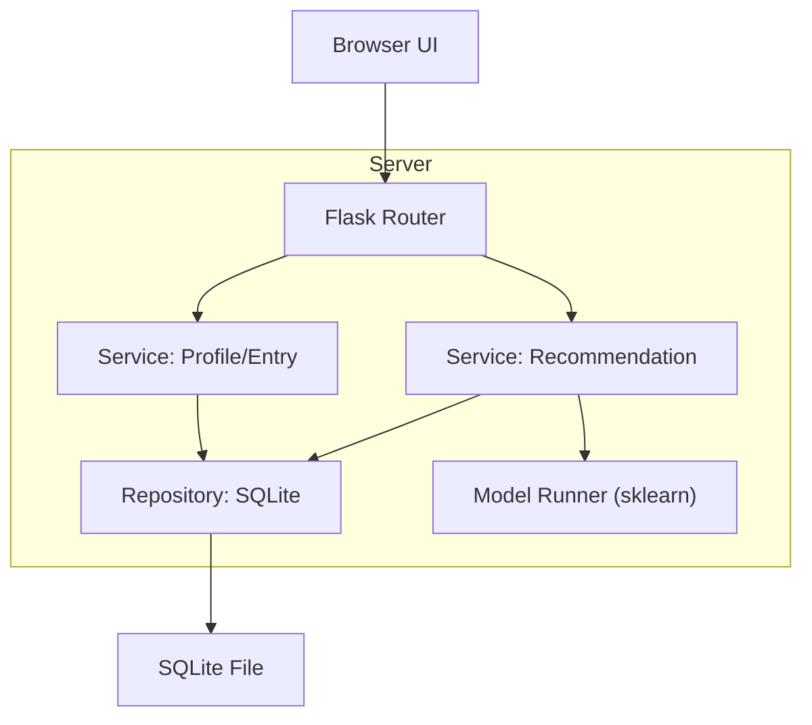
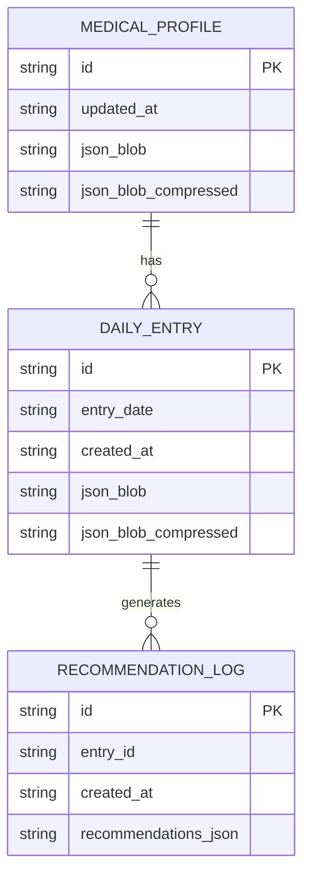

## 1.Architecture design



## 2.Technology Description

* Frontend: HTML5 + CSS3 + Vanilla JavaScript (Fetch API)

* Backend: Python + Flask (or FastAPI) + Jinja2 templates (optional)

* Database: SQLite (single-file, local)

* ML: scikit-learn + joblib (model persistence)

* Compression: zlib (compress JSON blobs before storing) + base64 (optional for transport)

## 3.Route definitions

| Route                       | Purpose                                                           |
| --------------------------- | ----------------------------------------------------------------- |
| /                           | Dashboard page (summary, recommendations, trends, recent entries) |
| /profile                    | Medical profile intake + baselines + import/export                |
| /checkin                    | Daily wellness check-in form + submission summary                 |
| /api/profile                | Read/update profile data (JSON)                                   |
| /api/entries                | Create/list daily entries (JSON)                                  |
| /api/recommendations/latest | Return latest recommendation set (JSON)                           |
| /api/export                 | Download all data as JSON backup                                  |
| /api/import                 | Upload JSON backup and restore locally                            |

## 4.API definitions (If it includes backend services)

### 4.1 Shared data types (TypeScript-like)

```ts
type MedicalProfile = {
  id: string;
  updatedAt: string;
  conditions: string[];
  surgeries: string[];
  familyHistory: string[];
  allergies: string[];
  medications: { name: string; dose?: string; frequency?: string }[];
  baselines: {
    age?: number;
    heightCm?: number;
    weightKg?: number;
    restingHr?: number;
    typicalSleepHours?: number;
  };
  notes?: string;
};

type DailyEntry = {
  id: string;
  date: string; // YYYY-MM-DD
  sleepHours?: number;
  sleepQuality?: number; // 1-5
  mood?: number; // 1-5
  stress?: number; // 1-5
  activityMinutes?: number;
  pain?: number; // 0-10
  symptoms?: string[];
  notes?: string;
  createdAt: string;
};

type Recommendation = {
  id: string;
  title: string;
  text: string;
  priority: "low" | "medium" | "high";
  rationale?: string;
  modelScore?: number; // 0..1
};
```

### 4.2 Core endpoints

* `GET /api/profile` -> `MedicalProfile`

* `PUT /api/profile` (body: `MedicalProfile`) -> `{ ok: boolean }`

* `GET /api/entries?from=YYYY-MM-DD&to=YYYY-MM-DD` -> `DailyEntry[]`

* `POST /api/entries` (body: `DailyEntry` without id/createdAt) -> `{ ok: boolean, entryId: string }`

* `GET /api/recommendations/latest` -> `{ date: string, recommendations: Recommendation[] }`

* `GET /api/export` -> `{ profile: MedicalProfile, entries: DailyEntry[] }`

* `POST /api/import` (body: export JSON) -> `{ ok: boolean }`

## 5.Server architecture diagram (If it includes backend services)



## 6.Data model(if applicable)

### 6.1 Data model definition



### 6.2 Data Definition Language

Medical profile table

```sql
CREATE TABLE IF NOT EXISTS medical_profile (
  id TEXT PRIMARY KEY,
  updated_at TEXT NOT NULL,
  json_blob TEXT NOT NULL,
  json_blob_compressed BLOB
);
```

Daily entries table

```sql
CREATE TABLE IF NOT EXISTS daily_entry (
  id TEXT PRIMARY KEY,
  entry_date TEXT NOT NULL,
  created_at TEXT NOT NULL,
  json_blob TEXT NOT NULL,
  json_blob_compressed BLOB
);
CREATE INDEX IF NOT EXISTS idx_daily_entry_date ON daily_entry(entry_date);
```

Recommendation log table

```sql
CREATE TABLE IF NOT EXISTS recommendation_log (
  id TEXT PRIMARY KEY,
  entry_id TEXT NOT NULL,
  created_at TEXT NOT NULL,
  recommendations_json TEXT NOT NULL
);
CREATE INDEX IF NOT EXISTS idx_reco_entry_id ON recommendation_log(entry_id);
```

Initial data (single local profile)

```sql
INSERT OR IGNORE INTO medical_profile (id, updated_at, json_blob)
VALUES ('local', datetime('now'), '{"conditions":[],"surgeries":[],"familyHistory":[],"allergies":[],"medications":[],"baselines":{}}');
```

